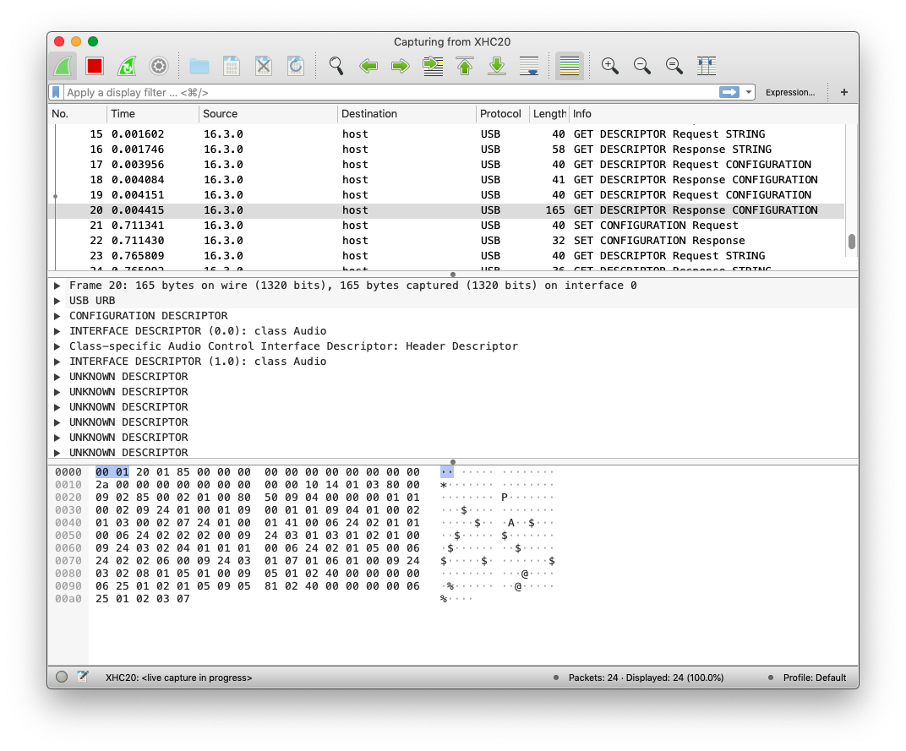

## USBD-MIDI

Some notes on USB MIDI and STM32_USB_Device_Library

Resources used when creating the class

- [USB Made Simple](http://www.usbmadesimple.co.uk/)
- [Universal Serial Bus Device Class Definition for MIDI Devices](https://www.usb.org/sites/default/files/midi10.pdf)
- [STM32_USB_Device_Library](https://github.com/samjkent/stm32f4-midi-brain/blob/master/Middlewares/ST/STM32_USB_Device_Library/)

### usbd_midi.h

Creates a typedef that will hold RX and TX buffers, a TX busy flag, and the number of bytes to send in the next TX.

The buffers are the maximum possible size USB_FS_MAX_PACKET_SIZE (64) bytes, but as the MIDI data is processed immediately they will only contain the most recent RX/TX data. 
Buffering may be required if any real time features are added.

```
typedef struct
{
  uint8_t                    rx_buffer[USB_FS_MAX_PACKET_SIZE];
  uint8_t                    tx_buffer[USB_FS_MAX_PACKET_SIZE];
  uint8_t                    tx_busy;
  uint8_t                    tx_length;
} USBD_MIDI_HandleTypeDef;
```

Callback functions for the USB-MIDI interface

```
typedef struct
{
    int8_t  (*Init)         (USBD_HandleTypeDef *pdev, uint8_t cfgidx);
    int8_t  (*DeInit)       (USBD_HandleTypeDef *pdev, uint8_t cfgidx);
    int8_t  (*Receive)      (uint8_t* pbuf, uint32_t size);
    int8_t  (*Send)      (uint8_t* pbuf, uint32_t size);
} USBD_MIDI_ItfTypeDef;
```

Exported functions for use in `usbd_device`, and `usbd_midi_if.c`

### usbd_midi.c

USB-MIDI Class typedef
- Currently only use \_Init, \_DeInit, \_DataIn, \_DataOut (others all return USBD_OK)

```
USBD_ClassTypeDef  USBD_MIDI =
{
  USBD_MIDI_Init,
  USBD_MIDI_DeInit,
  USBD_MIDI_Setup,
  USBD_MIDI_EP0_TxReady,
  USBD_MIDI_EP0_RxReady,
  USBD_MIDI_DataIn,
  USBD_MIDI_DataOut,
  USBD_MIDI_SOF,
  USBD_MIDI_IsoINIncomplete,
  USBD_MIDI_IsoOutIncomplete,
  USBD_MIDI_GetCfgDesc,
  USBD_MIDI_GetCfgDesc,
  USBD_MIDI_GetCfgDesc,
  USBD_MIDI_GetDeviceQualifierDesc,
};
```

USBD_MIDI_CfgDesc contains the device descriptors, based on the descriptors listed in on Appendix B. of [Universal Serial BusDevice Class Definition for MIDI Devices 1.0](https://www.usb.org/sites/default/files/midi10.pdf)

Modify this to add/remove endpoints, and MIDI interfaces. The descriptors can be verified using Wireshark. 

Note: On MacOS `sudo ifconfig XHC20 up` is required to allow Wireshark to monitor the USB port



```
/* USB MIDI device Configuration Descriptor */
__ALIGN_BEGIN static uint8_t USBD_MIDI_CfgDesc[USB_MIDI_CONFIG_DESC_SIZ] __ALIGN_END =
{
...
```

Creates the endpoints, USB-MIDI class (`USBD_MIDI_HandleTypeDef`), and sets up the OUT (Direction: HOST->DEVICE) endpoint to receive data

`USBD_MIDI_DeInit` does the inverse of this and frees the USB device of this class

```
/**
  * @brief  USBD_MIDI_Init
  *         Initialize the MIDI interface
  * @param  pdev: device instance
  * @param  cfgidx: Configuration index
  * @retval status
  */
static uint8_t  USBD_MIDI_Init (USBD_HandleTypeDef *pdev, uint8_t cfgidx)
{
  USBD_MIDI_HandleTypeDef   *hmidi;

  /* Open EP OUT */
  USBD_LL_OpenEP(pdev, MIDI_OUT_EP, USBD_EP_TYPE_BULK, USB_FS_MAX_PACKET_SIZE);
  pdev->ep_out[MIDI_OUT_EP & 0xFU].is_used = 1U;
  
  /* Open EP IN */
  USBD_LL_OpenEP(pdev, MIDI_IN_EP, USBD_EP_TYPE_BULK, USB_FS_MAX_PACKET_SIZE);
  pdev->ep_in[MIDI_IN_EP & 0xFU].is_used = 1U;

  /* Allocate MIDI structure */
  pdev->pClassData = USBD_malloc(sizeof (USBD_MIDI_HandleTypeDef));

  if(pdev->pClassData == NULL)
  {
    return USBD_FAIL;
  }
  else
  {
    hmidi = (USBD_MIDI_HandleTypeDef*) pdev->pClassData;

    hmidi->tx_busy = 0;

    /* Prepare Out endpoint to receive 1st packet */
    USBD_LL_PrepareReceive(pdev, MIDI_OUT_EP, hmidi->rx_buffer,
                           USB_FS_MAX_PACKET_SIZE);
  }
  return USBD_OK;
}
```

The `DataIn` function occurs when data has been transferred from Device to Host
The function clears the `tx_busy` flag to allow another transmission

Note: if buffers are added `DataIn` will have to reset the Tx buffer

```
static uint8_t  USBD_MIDI_DataIn (USBD_HandleTypeDef *pdev,
                              uint8_t epnum)
{

  USBD_MIDI_HandleTypeDef   *hmidi;
  hmidi = (USBD_MIDI_HandleTypeDef*) pdev->pClassData;
  hmidi->tx_busy = 0;
  
  return USBD_OK;
}
```

DataOut should receive a 4 byte MIDI event packet (virtual cable + 3 byte MIDI)

Additional code to handle longer packets is included to potentially add DFU via MIDI

Received bytes are sent to the `Receive` callback, found in `usbd_midi_if.c`

Finally the endpoint is prepped to receive another packet

```
static uint8_t  USBD_MIDI_DataOut (USBD_HandleTypeDef *pdev,
                              uint8_t epnum)
{
  USBD_MIDI_HandleTypeDef   *hmidi;
  hmidi = (USBD_MIDI_HandleTypeDef*) pdev->pClassData;

  if (epnum == MIDI_OUT_EP)
  {
    /* Get data length and actual data */
    size_t length = USBD_LL_GetRxDataSize(pdev, epnum);
    uint8_t  *rx_buffer = hmidi->rx_buffer;

    /* Pass data to Receive() */
    // for (uint32_t i=0; i < length; i+=4) {
        ((USBD_MIDI_ItfTypeDef *)pdev->pUserData)->Receive(rx_buffer, length);
    // }

    /* Prepare Out endpoint to receive next midi packet */
    USBD_LL_PrepareReceive(pdev, MIDI_OUT_EP, hmidi->rx_buffer,
                           USB_FS_MAX_PACKET_SIZE);
  }

  return USBD_OK;
}
```

`RegisterInterface` adds the callback functions to the USB device

```
uint8_t  USBD_MIDI_RegisterInterface  (USBD_HandleTypeDef   *pdev,
                                        USBD_MIDI_ItfTypeDef *fops)
{
  if(fops != NULL)
  {
    pdev->pUserData= fops;
  }
  return USBD_OK;
}
```

`_SetTXBuffer` is used to set the devices `tx_buffer` and `tx_length`

This is used in conjuction with `_TransmitPacket` and could be extended if a buffered approach is used

```
uint8_t  USBD_MIDI_SetTxBuffer  (USBD_HandleTypeDef   *pdev,
                                uint8_t  *buff,
                                uint16_t length)
{
  USBD_MIDI_HandleTypeDef   *hmidi = (USBD_MIDI_HandleTypeDef*) pdev->pClassData;

  // hmidi->tx_buffer = buff;
  memcpy(hmidi->tx_buffer, buff, length);
  hmidi->tx_length = length;

  return USBD_OK;
}
```

`_TransmitPacket` checks the busy flag, and if it's clear transmits the data to the IN endpoint

When transmission begins `tx_busy` is set and will be cleared by `_DataIn` when TX completes

```
uint8_t  USBD_MIDI_TransmitPacket(USBD_HandleTypeDef *pdev)
{
  USBD_MIDI_HandleTypeDef   *hmidi = (USBD_MIDI_HandleTypeDef*) pdev->pClassData;

  if(hmidi->tx_busy == 0) {

    hmidi->tx_busy = 1;
    pdev->ep_in[MIDI_IN_EP & 0xFU].total_length = hmidi->tx_length;

    /* Transmit */
    USBD_LL_Transmit(pdev, MIDI_IN_EP, hmidi->tx_buffer,
                     (uint8_t)hmidi->tx_length);
    
    return USBD_OK;
  } else {
    return USBD_BUSY;
  }
}
```

### usbd_midi_if.h

The interface file exports MIDI functions that will be used by other parts of the program

For example:

```
void MIDI_note_on(uint8_t note, uint8_t velocity);
void MIDI_note_off(uint8_t note, uint8_t velocity);
```

### usbd_midi_if.c

Function prototypes are created and added to `USBD_MIDI_ItfTypeDef` to be used by `usbd_midi.c`

`Init` and `DeInit` currently return without doing anything, but could be used to illuminate an LED when USB is brought up/taken down

```
static int8_t MIDI_Init     (USBD_HandleTypeDef *pdev, uint8_t cfgidx);
static int8_t MIDI_DeInit   (USBD_HandleTypeDef *pdev, uint8_t cfgidx);
static int8_t MIDI_Receive  (uint8_t* pbuf, uint32_t length);
static int8_t MIDI_Send     (uint8_t* pbuf, uint32_t length);

USBD_MIDI_ItfTypeDef USBD_MIDI_fops =
{
  MIDI_Init,
  MIDI_DeInit,
  MIDI_Receive,
  MIDI_Send
};
```

`MIDI_Send` is used to send data to the host

It takes the buffer passed to it and sets it in the USB MIDI class using `SetTxBuffer`

Then `USBD_MIDI_TransmitPacket(&hUsbDeviceFS)` initiates the transfer

This function will be called from more useful functions that create MIDI events e.g. Note On, Note Off, Control Change

```
static int8_t MIDI_Send (uint8_t* buffer, uint32_t length)
{
  uint8_t ret = USBD_OK;

  USBD_MIDI_SetTxBuffer(&hUsbDeviceFS, buffer, length);

  ret = USBD_MIDI_TransmitPacket(&hUsbDeviceFS);

  return (ret);
}
```

`MIDI_Receive` takes a 4 byte buffer containing a MIDI event packet

The virtual cable number is currently ignored and the packet is processed

The only option in the example code is a MIDI Reset command, which resets the STM32 into it's bootloader

```
static int8_t MIDI_Receive (uint8_t* buffer, uint32_t length)
{

  uint8_t chan = buffer[1] & 0xf;
  uint8_t msgtype = buffer[1] & 0xf0;
  uint8_t b1 =  buffer[2];
  uint8_t b2 =  buffer[3];
  uint16_t b = ((b2 & 0x7f) << 7) | (b1 & 0x7f);
  
  switch (msgtype) {
  case 0xF0:
    if(chan == 0x0F) {
        NVIC_SystemReset(); // Reset into DFU mode
    }
  	break;
  default:
  	break;
  }
  
  return (0);
}
```

An example MIDI function

`MIDI_note_on` takes note and velocity data and creates a MIDI event packet with a preset virtual cable

```
void MIDI_note_on(uint8_t note, uint8_t velocity) {
    uint8_t b[4];
    b[0] = 0x0B;
    b[1] = 0x90;
    b[2] = note;
    b[3] = velocity;

    MIDI_Send(b, 4);

}
```
